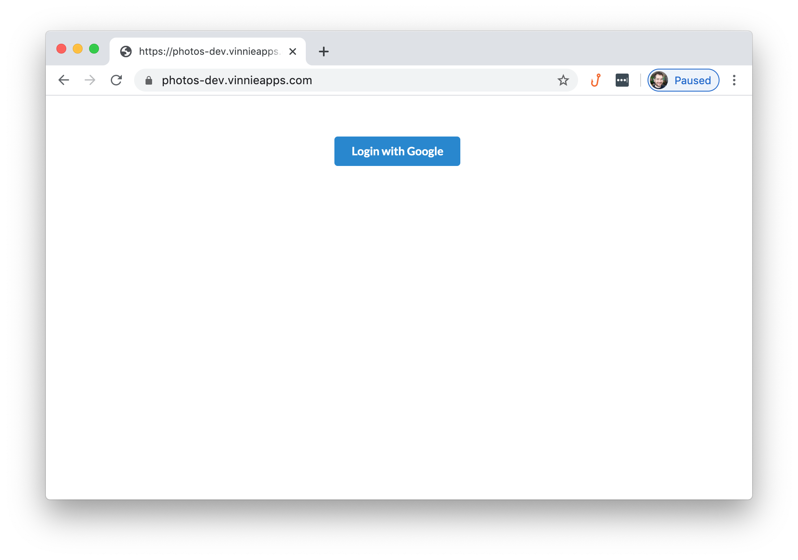
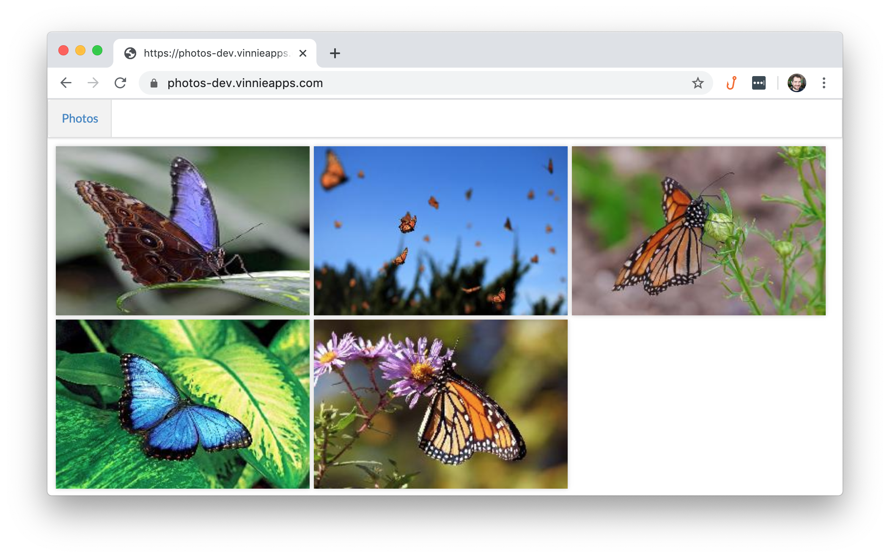
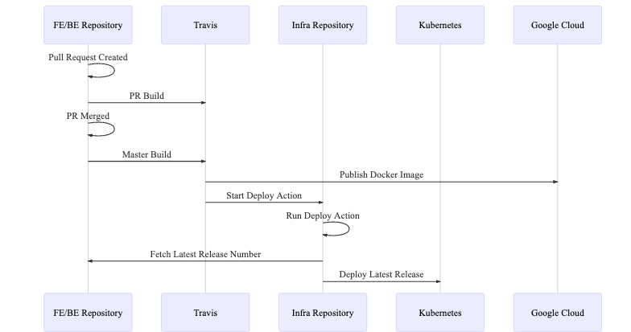

# Photos

**Stage**: Developmnet 
**Adoption Phase**: Not in Production 
**Alternatives**:
  [Flickr](https://www.flickr.com/),
  [Google Photos](https://photos.google.com)  
**One liner**: Photos aim to help you store and organize your photos and videos. 

# Description

Still under development, it provides *login with Google*:

And a view of all the previews for the uploaded content:

# Architecture

## Tech Stack

### Frontend

Repo: https://github.com/VinnieApps/photos-frontend

Single page application using React and React Router. Deployed in a Docker container serving the static files using [SPA Server](https://github.com/VinnieApps/spa-server).

### Backend

Repo: https://github.com/VinnieApps/photos

REST API using Spring Boot, JDBI and MySQL to store the metadata. Users are authenticated using JWT tokens.

All uploads are stored in Google Storage. As of now, two buckets are used: main and thumbnails.

Post processing including generating thumbnails happen on background jobs.

All code gets deployed in Docker images.

### Infratructure

Repo: https://github.com/VinnieApps/vinnieapps-infrastructure

A GKE Kubernetes cluster forms the base of this infrastructure.

[Contour](https://github.com/projectcontour/contour) is used as gateway with Envoy routing all traffic.

MySQL runs inside the cluster as a StatefulSet.

The application gets deployed directly to Kubernetes using kubectl.

### Continuous Deploy

Setup with a mix of Travis and GitHub actions.

Sequence Diagram for updates coming from backend or frontend:

